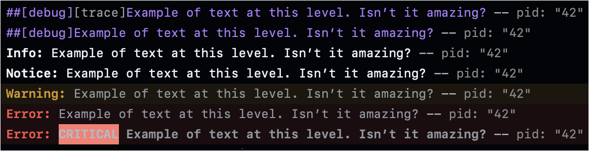

# 🤖 GHALogger (**G**it**H**ub **A**ctions Logger)

<picture></picture>
<picture></picture>
<picture></picture>
[](<https://github.com/xcode-actions/gha-logger/releases>)

A simple [swift-log](<https://github.com/apple/swift-log>)-compatible logger designed for GitHub Actions.

## Usage 🤓

Bootstrap the LoggingSystem with `GHALogger` before creating any logger:
```swift
LoggingSystem.bootstrap(GHALogger.init, metadataProvider: nil/* or whatever you want */)
```

A common pattern is to use a `GHALogger` when running in GitHub Actions and another logger otherwise (e.g. a [`CLTLogger`](<https://github.com/xcode-actions/clt-logger>) one):
```swift
/* Detect whether process is running in GitHub Actions. */
let isGitHubActionsRun = ProcessInfo.processInfo.environment["GITHUB_ACTIONS"] == "true"

/* Bootstrap the logger and make it available globally. */
LoggingSystem.bootstrap(isGitHubActionsRun ? GHALogger.init : CLTLogger.init, metadataProvider: nil)

/* Create a logger.
 * We set the log level to debug if running in GitHub Actions with `RUNNER_DEBUG` set to `1`.
let logger: Logger = {
    var ret = Logger(label: "main")
    ret.logLevel = (!isGitHubActionsRun || ProcessInfo.processInfo.environment["RUNNER_DEBUG"] != "1") ? .info : .debug
    return ret
}()
```

## Screenshot 📺

<picture>
	<source srcset="./Docs/Screens/ghalogger-logs-example.png" width="582">
	
</picture>

## Design 📖

- Logs with level `critical`, `error`, `warning` and `notice` are sent as GitHub Actions commands, linked to the file and line that sent the log.
The `critical` level is logged with an additional colored prefix, to make sure the log is visible.
- Logs with level `debug` are sent as a GitHub Actions command, though this command is not linked to the file that sent the log (the command does not support it).
- Other log levels are logged with specific prefixes, usually with colors.

## Sending Raw Commands

GitHub Actions supports receiving commands that are parsed on `stdout` and `GHALogger` supports sending those commands directly.
Use the `GHALogger.sendCommand` method to send commands.

For instance, to create a group of lines, do:
```swift
if isGitHubActionsRun {GHALogger.sendCommand(.startGroup, withText: "The start of my group.")}
defer {if isGitHubActionsRun {GHALogger.sendCommand(.endGroup)}}
logger.warning("We might have a problem.")
...
```
